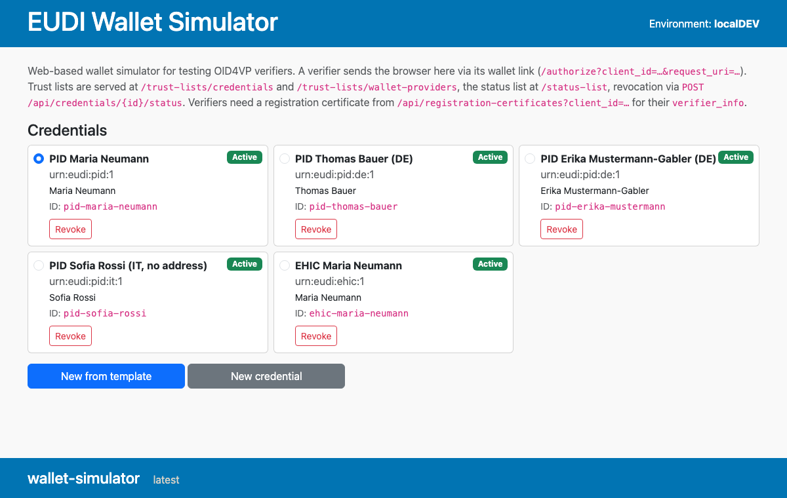
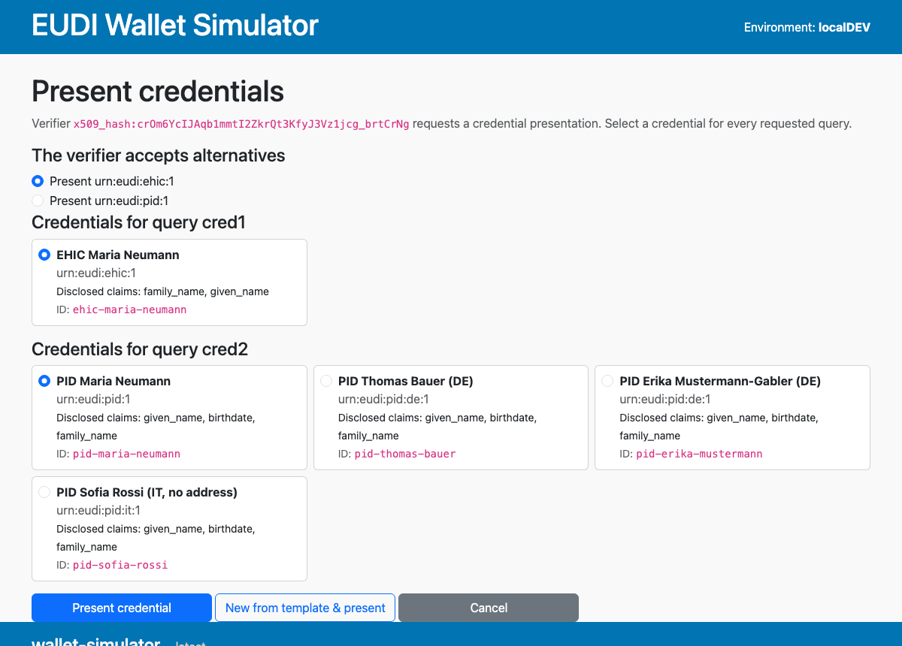

# EUDI Wallet Simulator

A web based EUDI wallet for testing OID4VP verifiers. There is no issuance and no custom URL
scheme. The verifier's wallet link opens a credential picker in the browser. The simulator answers
with a signed SD-JWT VC presentation. It works with any OID4VP verifier. A ready to run example
with [keycloak-extension-oid4vp](https://github.com/ba-itsys/keycloak-extension-oid4vp) is
included.



## Quickstart

```sh
mvn spring-boot:run           # http://localhost:8080
```

A ready to run Keycloak verifier setup is in [`examples/keycloak`](examples/keycloak/README.md).

## Connecting your verifier

1. Point the verifier's wallet URL at `http://localhost:8080/authorize`. The verifier appends
   `client_id` and `request_uri`. HAIP is mandatory here, so only the `x509_hash` client
   identifier prefix and the encrypted response mode `direct_post.jwt` are accepted.
2. Configure the trust anchor. The verifier finds the credential issuers in the ETSI TS 119 602
   trust list at `GET /api/trust-lists/credentials`. Wallet providers are listed at
   `GET /api/trust-lists/wallet-providers`.
3. Get a registration certificate. Every request must carry `verifier_info`. Call
   `GET /api/registration-certificates?client_id=x509_hash:…` and put the returned `verifierInfo`
   value into the verifier configuration. The registrar key is persisted. The certificate stays
   valid across simulator restarts.

### Registration certificate example

The client_id is the base64url SHA-256 hash of the verifier's signing certificate:

```sh
HASH=$(openssl x509 -in verifier-cert.pem -outform DER \
  | openssl dgst -sha256 -binary | openssl base64 -A | tr '+/' '-_' | tr -d '=')
curl "http://localhost:8080/api/registration-certificates?client_id=x509_hash:${HASH}&purpose=Login"
```

The response contains the raw certificate and the ready to paste `verifierInfo` value. The
`verifierInfo` member is a JSON array serialized into a string because verifier configuration
fields usually take text. In the request object the claim is the plain array
`[{"format": "registration_cert", "data": "…"}]` as defined by ETSI TS 119 472-2. The data
member is the base64url encoding of the signed registration certificate (an `rc-wrp+jwt` per
ETSI TS 119 475):

```json
{
  "registrationCertificate": "eyJ0eXAiOiJyYy13cnArand0IiwieDVjIjpbIi...",
  "verifierInfo": "[{\"format\":\"registration_cert\",\"data\":\"ZXlKMGVYQWlPaUp5WXkxM2Nu...\"}]"
}
```

For keycloak-extension-oid4vp put the `verifierInfo` string into the `oid4vp` identity provider
configuration:

```json
{
  "alias": "oid4vp",
  "providerId": "oid4vp",
  "config": {
    "verifierInfo": "[{\"format\":\"registration_cert\",\"data\":\"ZXlKMGVYQWlPaUp5WXkxM2Nu...\"}]"
  }
}
```

In the Keycloak admin console the same value goes into the *Verifier Info (JSON)* field of the
`oid4vp` identity provider. The rendered realm in `examples/keycloak/realm-wallet-demo.json`
shows a complete working configuration.

## Using the UI

The home page shows all wallet credentials as cards. You can revoke and activate them, clone one
as a template with *New from template*, or create one from scratch with *New credential*. Every
claim is a form field. Nested claims use dot notation, for example address.locality. A checkbox
per claim marks it as always disclosed, which makes it a plain member of the credential body
instead of a selectively disclosable one. In the seed file the same is expressed per credential
with `alwaysDisclosedClaims`.

The pre defined PID credentials use the claim names of the EUDI PID rulebook for the SD-JWT VC
encoding. The rulebook requires no attribute to be a plain member of the credential body, so all
seeded claims are selectively disclosable. The two `urn:eudi:pid:de:1` credentials follow the
German PID rulebook instead, which carries no document number, no personal administrative number,
no issuing jurisdiction and no sex, adds `source_document_type`, `birth_name` and
`age_equal_or_over`, and stores string values in upper case. The Italian credential keeps the EU
optional attributes so a verifier can be tested against those as well.

During a verification the picker shows one selection group per requested DCQL credential query.
The evaluation covers vct and claim matching, claim_sets in preference order, credential_sets
combinations and trusted_authorities (aki and etsi_tl). A trusted authority that points at one of
the wallet's own trust lists is resolved locally, which keeps split host names between verifier
and wallet from breaking the match. Credentials that do not match are not offered. The answer is a multi entry vp_token when several queries are requested.
When the verifier accepts alternatives, you choose the outcome instead of the wallet deciding.
Credential set options are offered as a choice, optional sets can be skipped, and every
satisfiable claim set of a query is listed for selection.



The alternatives are dropdowns. Choosing one switches the credential rows below to exactly the
queries that alternative requests, which keeps the page readable when a verifier offers many
combinations. The claim set dropdown per query works the same way and updates the disclosed
claims shown on each credential.

*Present credentials* answers with one presentation per requested query. Each query row has its
own *New from template*, which clones the credential selected in that row and lets you change the
claims. Such a credential is issued for the current presentation only. It keeps the id and the
status list slot of the credential it came from, so it replaces that credential for this flow and
revoking the wallet credential also invalidates it. It travels with the form and never enters the
wallet, so a presentation flow cannot change what later requests see. Persistent credentials are
created on the start page. Every issued credential gets a fresh holder binding key.

Conformance warnings appear on the picker when the verifier request violates OID4VP or HAIP. In
`strict` mode such requests are refused and the wallet answers the verifier with an
`invalid_request` error response per OID4VP 1.0 §8.5. Cancelling sends `access_denied`. Error
responses are encrypted for `direct_post.jwt`.

## Automating the UI

The UI is server rendered and every interactive element has a stable id. One small script toggles
the visibility of the selected alternatives, everything else is plain form posts. Playwright and
similar frameworks can rely on these selectors.

| Selector | Element |
|---|---|
| `[data-credential-id="<id>"]` | Credential card on the home page and the picker |
| `#select-<id>` | Radio button that selects a credential on the home page |
| `#select-<queryId>-<id>` | Radio button on the picker, one group per DCQL credential query |
| `#present-credential`, `#cancel-presentation` | Actions on the picker |
| `#new-from-template-<queryId>` | Clone the credential selected for that query and issue the clone for this presentation |
| `#new-from-template`, `#new-credential`, `#toggle-status-<id>` | Actions on the home page |
| `#credential-id`, `#credential-name`, `#credential-vct`, `#validity-days` | Edit form header fields |
| `#claim-<name>` | One input per claim on the edit form. Nested claims use dot notation, for example `claim-address.locality` |
| `#always-disclosed-<name>` | Checkbox marking a claim as always disclosed |
| `#set-option-<setIndex>` | Credential set dropdown on the picker. Each option carries `data-query-ids`, a comma separated list. The value `skip` drops an optional set |
| `[data-query-slot="<queryId>"]` | Row of one DCQL credential query on the picker. An option that names several query ids shows one row per id |
| `#claim-set-<queryId>` | Claim set dropdown for a query on the picker |
| `#new-claim-name`, `#new-claim-value`, `#add-claim` | Add a claim on the edit form |
| `#issue-credential`, `#cancel-edit` | Edit form actions |
| `#conformance-warnings`, `#form-error` | Warning and error containers |

Switch alternatives with `selectOption` on the dropdown. The rows of the other alternatives carry
the `hidden` attribute, so a framework waiting for visibility naturally waits for the right row
instead of clicking something the verifier did not ask for.

A full flow needs no fixed waits. Each action is a plain form post and the next page contains the
selectors above. Clients that do not run scripts, for example curl, see all rows and can post the
same form values directly. `examples/keycloak/smoke-test.sh` drives the whole login that way.

## Configuration

| Property | Default | Purpose |
|---|---|---|
| `app.base-url` | `http://localhost:8080` | External base URL embedded in issued tokens |
| `app.mode` | `debug` | `debug` warns and continues. `strict` refuses non conformant requests |
| `app.pki.dir` | `data/pki` | PEM directory for the persisted CA, issuer, wallet provider and registrar keys |
| `app.resources.credentials` | `classpath:credentials.yml` | Pre defined credential seed. Any Spring resource works, for example `file:my-credentials.yml` |
| `app.basepath` | *(empty)* | URL prefix when deployed behind a path rewriting ingress |
| `server.port` | `8080` | HTTP port |

Environment variable form: `APP_BASEURL`, `APP_MODE`, `SERVER_PORT`.

Credentials, ad hoc changes and revocations are held in memory and reset on restart. The key
material persists, see below.

## Key material

On startup the simulator loads its PKI from `app.pki.dir`. Missing files are generated and
written there, so the first start creates everything and later starts reuse it. Trust lists and
registration certificates stay valid across restarts as long as the directory content is kept.

The directory contains PEM files for five key pairs. `<name>` is one of `ca`, `issuer`,
`wallet-provider`, `registrar` and `holder`.

| File | Content |
|---|---|
| `<name>-key.pem` | PKCS#8 private key (P-256) |
| `<name>-pub.pem` | Public key |
| `<name>-cert.pem` | X.509 certificate (all except `holder`, issued by the `ca`) |

`ca` is the trust anchor published in the trust lists. `issuer` signs credentials and the status
list. `registrar` signs registration certificates. `wallet-provider` signs wallet attestations.
`holder` is the wallet instance key used for attestation proof of possession.

For Kubernetes, pre-supply the directory as a secret so the key material is stable from the
first start on. Generate the files once by starting the simulator locally, then:

```sh
kubectl create secret generic wallet-simulator-pki --from-file=data/pki
```

```yaml
# deployment excerpt
containers:
  - name: wallet-simulator
    env:
      - name: APP_PKI_DIR
        value: /pki
    volumeMounts:
      - name: pki
        mountPath: /pki
        readOnly: true
volumes:
  - name: pki
    secret:
      secretName: wallet-simulator-pki
```

## API

Everything a machine calls lives under `/api`. The paths outside it are the ones a browser opens:
the wallet content at `/`, the verifier entry point `/authorize`, and the credential edit forms
under `/credentials`.

| Endpoint | Purpose |
|---|---|
| `GET /api/credentials`, `GET /api/credentials/{id}` | Wallet content with SD-JWT and status |
| `POST /api/credentials/{id}/status` `{"status": 1}` | Revoke with 1, reactivate with 0 |
| `GET /api/credentials/{id}/status` | Current status list value |
| `GET /api/status-list` | IETF Token Status List (`statuslist+jwt`) |
| `GET /api/trust-lists/credentials`, `GET /api/trust-lists/wallet-providers` | ETSI TS 119 602 LoTE JWTs |
| `GET /api/registration-certificates?client_id=…&purpose=…` | Issues an `rc-wrp+jwt` and the matching `verifierInfo` value |
| `GET /api/wallet-attestation?client_id=…&aud=…` | OAuth client attestation and PoP pair |
| `GET /api/config` | Effective configuration, for example the conformance mode |

## Development

```sh
mvn verify                    # tests and spotless formatting check
mvn spotless:apply            # format
examples/keycloak/smoke-test.sh   # headless E2E against the Keycloak example
```
